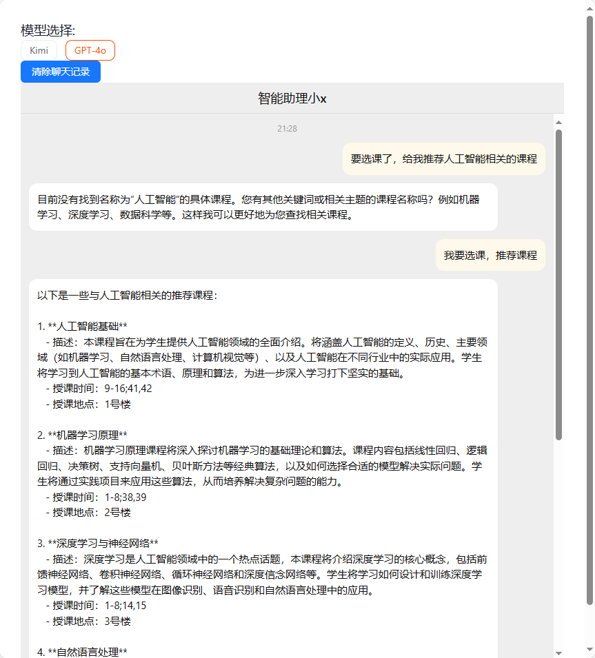
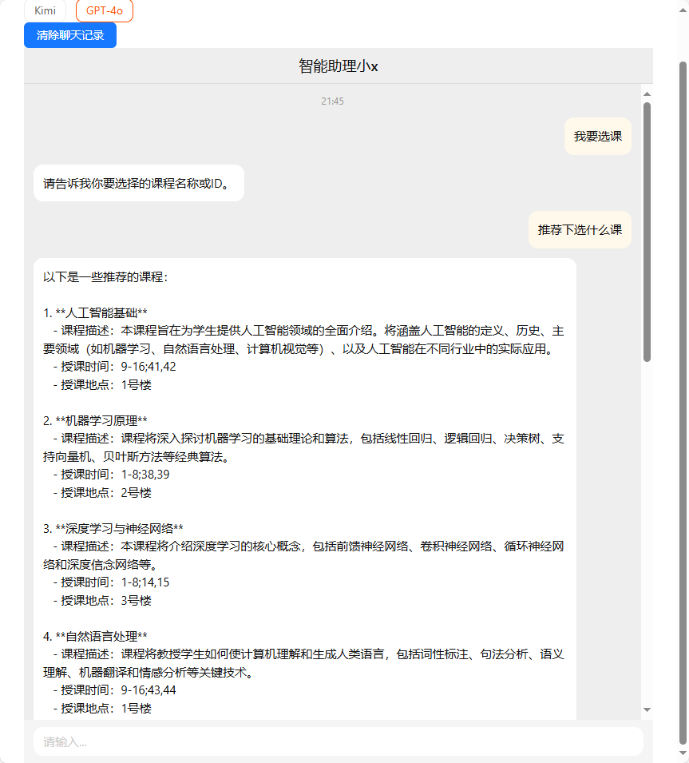
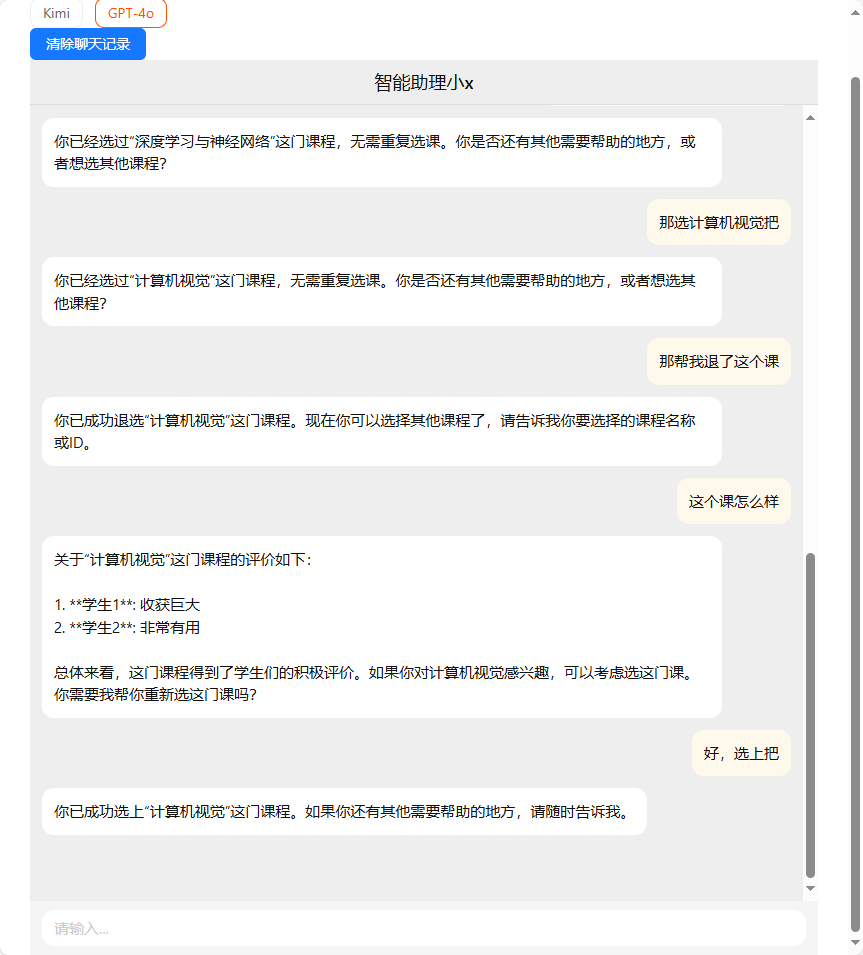

### kimi逆向

使用kimi逆向库 [LLM-Red-Team/kimi-free-api: 🚀 KIMI AI 长文本大模型逆向API白嫖测试【特长：长文本解读整理】，支持高速流式输出、智能体对话、联网搜索、长文档解读、图像OCR、多轮对话，零配置部署，多路token支持，自动清理会话痕迹。 (github.com)](https://github.com/LLM-Red-Team/kimi-free-api)


具体调用是 ，使用 该仓库在hub.docker.com的镜像库[vinlic/kimi-free-api Tags | Docker Hub](https://hub.docker.com/r/vinlic/kimi-free-api/tags)，按仓库文档里执行docker-compose部署。

具体部署：

1. 在服务器上创建docker-compose.yaml

```yaml
version: '3'

services:
  kimi-free-api:
    container_name: kimi-free-api
    image: vinlic/kimi-free-api:latest
    restart: always
    ports:
      - "8000:8000"
    environment:
      - TZ=Asia/Shanghai
```

2.  执行命令 

   ```shell
   docker-compose up -d
   ```

   

#### kimi逆向存在问题

kimi这个逆向的仓库不支持 使用agent技术 [支持函数调用吗？ · Issue #87 · LLM-Red-Team/kimi-free-api (github.com)](https://github.com/LLM-Red-Team/kimi-free-api/issues/87)。故而用了gpt


## agent实现

使用**langchain**这个包实现，使用文档见[构建一个简单的LLM应用程序 |🦜️🔗 LangChain的 --- Build a Simple LLM Application | 🦜️🔗 LangChain](https://python.langchain.com/v0.2/docs/tutorials/llm_chain/)

在backend/app/llm/__init__.py 中定义了gpt接口的调用 和 agent的工具实现，


### agent实现效果

#### 查询课程效果






#### 选课退课效果

